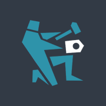

kolenka.net - это сайт небольшого коммьюнити разработчиков игр. В этом репозитории лежит бекенд всего сайта. У нас есть блоги, в которые пользователи могут писать посты, а другие пользователи могут комментировать эти посты.

## Используемые инструменты

* Python 3
* Flask
* peewee

## Подготовка к работе

Для начала необходимо установить pipenv

https://docs.python-guide.org/dev/virtualenvs/

Затем зайти в директорию проекта и выполнить:

`$ pipenv install`

Эта команда установит все зависимости из `Pipfile`.

Далее, запускаем новую сессию:

`$ pipenv shell`

Все переменые подгрузятся автоматически.

Запуск сервера:

`$ flask run`

Далее, открываем localhost:5000, должна открыться приветственная страница

Чтобы выйти из сессии:

`$ exit`

## Как помочь

Выбери задачу из [таск-трекера](https://github.com/NaKolenke/kolenka-doc/projects/1), сделай форк, внеси изменения, протестируй, сделай пулл-реквест. Все просто!
